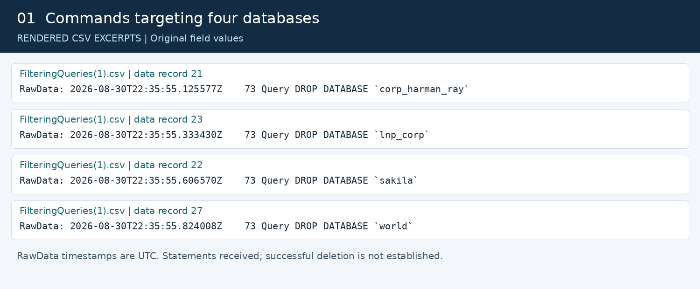
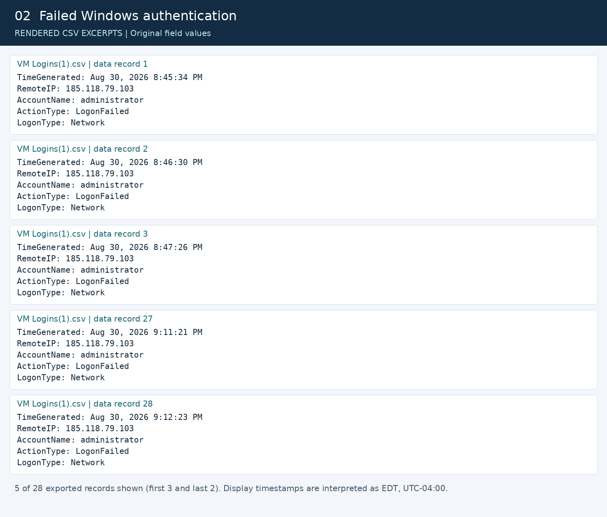
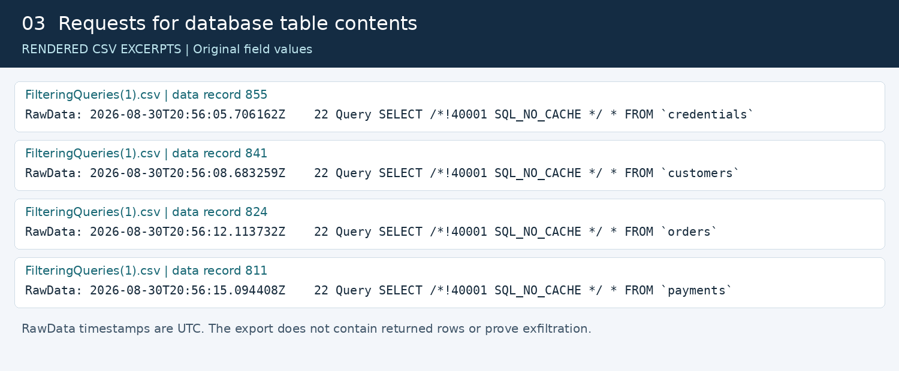
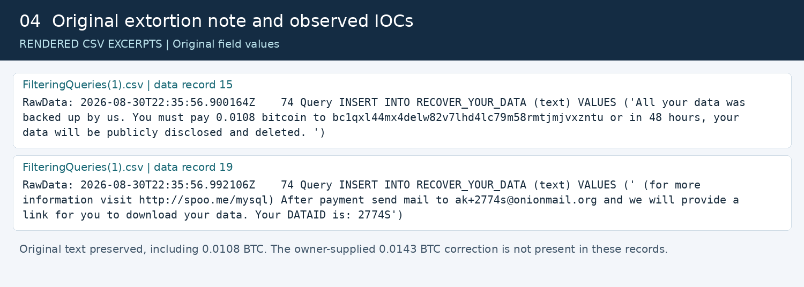
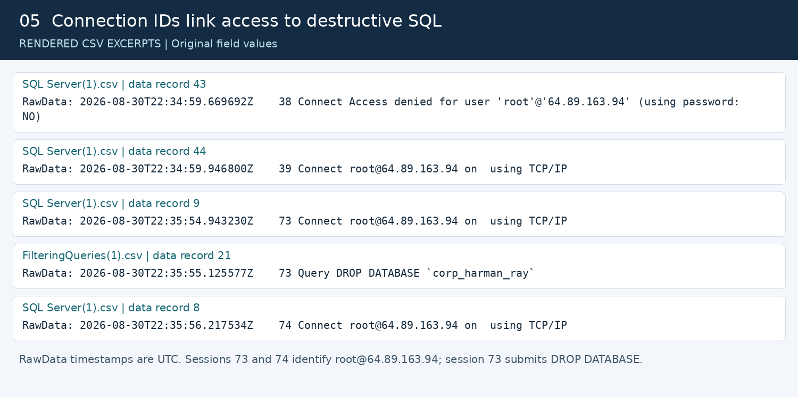
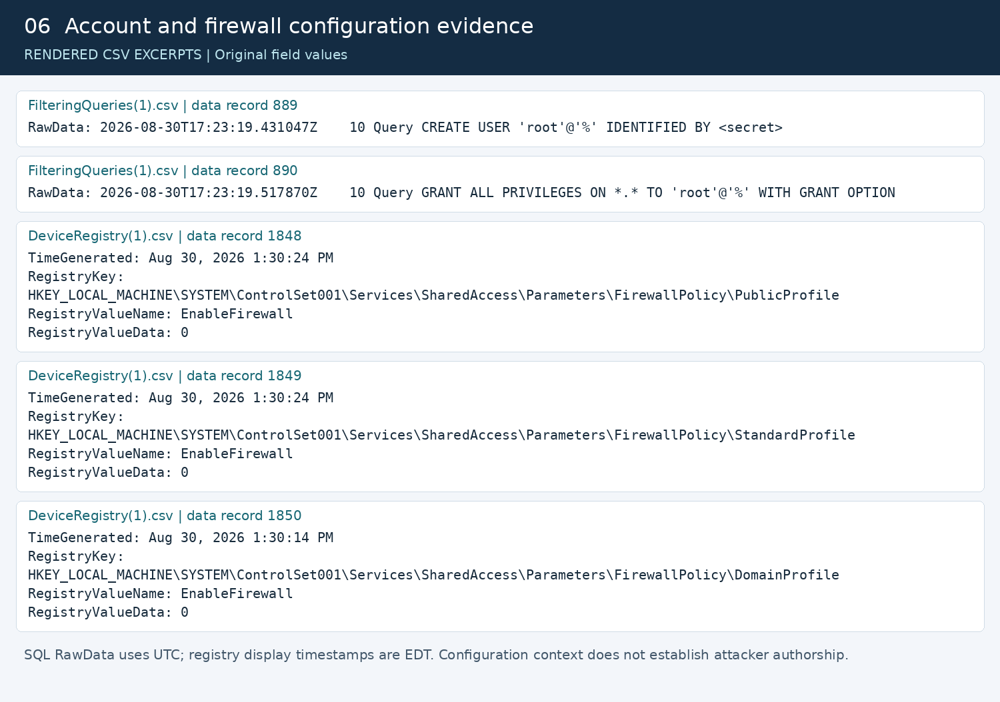
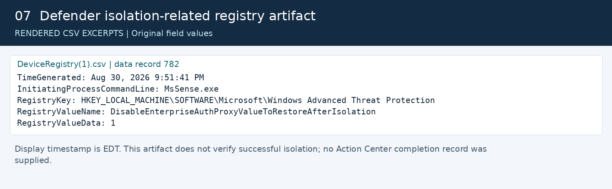
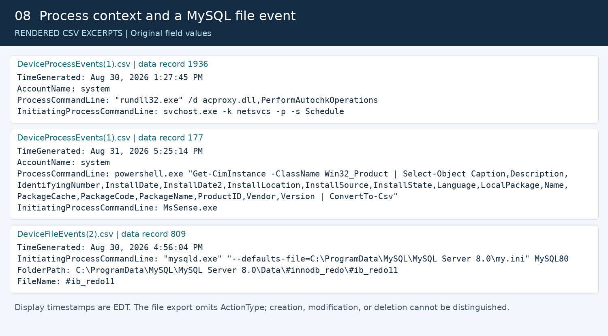
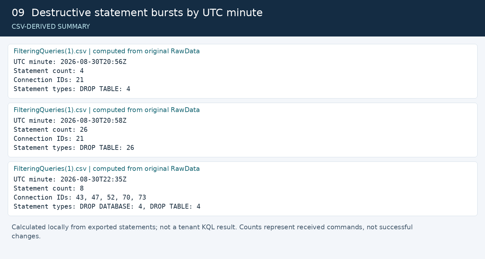

# MySQL Incident Response Report

**Asset:** CORP-HARMAN-RAY | **Environment:** personal lab | **Times:** UTC

**Evidence images:** rendered from the attached CSVs, with source filenames and one-based data-record numbers. Original field values are preserved. MDE image timestamps retain the original EDT display values; the narrative timeline uses UTC. These are not Defender portal captures or executed KQL results. Image 9 is a locally calculated summary.

## 1. Executive Summary

MySQL logs record external root access, table-reading queries, recovery-note statements, and commands to delete four databases on August 30, 2026. Connection IDs tie the later destructive sequence to root sessions from 64.89.163.94; the source of an earlier collection-and-deletion sequence is not determined from available logs. The evidence supports database extortion and attempted destruction, but completed deletion, exfiltration, encryption, and Windows takeover are not determined from available logs. Defender telemetry indicates investigation and isolation-related activity; completed containment and recovery are not verified.

**Hunt:** summarize destructive statements; receipt is not execution success.

```kusto
Sql
| where Command == "Query"
| where Statement matches regex @"(?i)^\s*(DROP|RENAME|TRUNCATE)\b"
| summarize Statements=count(), First=min(EventTime), Last=max(EventTime)
    by Statement
```

**Evidence image 1 - Destructive SQL results:**




## 2. Incident Details

- **Detection time / initial reporter:** not determined from available logs. Prepared for Harman Singh's lab portfolio; preparation is not proof of who first detected the incident.
- **Classification:** database extortion and attempted data destruction. **Assessed severity: High**, based on remote root access and destructive commands; not a supplied alert severity.
- **Affected asset:** CORP-HARMAN-RAY, private IP 10.3.0.33, MySQL TCP 3306. Targeted schemas: corp_harman_ray, lnp_corp, sakila, world. Additional affected hosts are not determined from available logs.
- **Windows access:** 28 failed administrator Network logons from 185.118.79.103; no success in that limited export. Network logon type alone does not identify RDP.

**Hunt:** retrieve successes and failures across the full window. Event times do not establish analyst detection time; obtain the alert/case audit trail separately.

```kusto
DeviceLogonEvents
| where Timestamp between (Start .. End) and DeviceName =~ Host
| summarize Events=count(), First=min(Timestamp), Last=max(Timestamp)
    by RemoteIP, AccountName, ActionType, LogonType
```

**Evidence image 2 - Failed authentication excerpts; alert/case timestamp unavailable:**




## 3. Impact Assessment

| Dimension | Supported assessment |
| --- | --- |
| Confidentiality | Full-table reads requested, including credentials, customers, orders, and payments. Returned data and exfiltration: not determined from available logs. |
| Integrity | Recovery-note INSERT/CREATE and destructive statements recorded. Successful changes and final database state: not determined from available logs. |
| Availability | Four DROP DATABASE commands and 34 DROP TABLE statements recorded. Completed deletion and downtime: not determined from available logs. |
| Scope and business impact | One lab host evidenced. Production impact, financial loss, and number of affected records: not determined from available logs. |

**Hunt:** inspect collection and modification statements. Validate actual impact with database state, error/binary logs, and application checks.

```kusto
Sql
| where Command == "Query"
| where Statement contains "SQL_NO_CACHE"
    or Statement matches regex @"(?i)^\s*(DROP|RENAME|TRUNCATE|INSERT|CREATE TABLE)\b"
| project EventTime, ConnectionId, Statement
| order by EventTime asc
```

**Evidence image 3 - Table reads and destructive statements:**




## 4. Indicators of Compromise

| Indicator | Value | Evidence / interpretation |
| --- | --- | --- |
| BTC wallet | `bc1qxl44mx4delw82v7lhd4lc79m58rmtjmjvxzntu` | Recovery-note INSERT text in FilteringQueries(1).csv |
| Contact email | `ak+2774s@onionmail[.]org` | Same note; defanged |
| Reference URL | `hxxp://spoo[.]me/mysql` | Same note; defanged; not verified as an exfiltration or command server |
| DATAID | `2774S` | Same note; case/reference identifier |
| Recovery artifacts | `RECOVER_YOUR_DATA`, `RECOVER_YOUR_DATA_info` | SQL database/table names; behavioral indicators |
| Remote IP | `64.89.163.94` | 39 identifiable root connection records; later destructive SQL session-correlated |
| Remote IP | `77.90.185.30` | Nine failed probes and one identifiable root connection; destruction not attributed |
| Remote IP | `213.209.159.115` | Three failed MySQL no-password probes |
| Remote IP | `185.118.79.103` | 28 failed Windows administrator Network logons |
| Investigative lead | `136.144.19.189` | Inbound MySQL connection immediately before earlier query sequence; timing-only correlation |

**Evidence discrepancy:** raw note text demands **0.0108 BTC**; the owner supplied **0.0143 BTC** as a correction. No supporting raw record for 0.0143 was found. The example wallet ending `apz99`, email `ak+28t2`, URL `2no[.]co/2mysql`, and DATAID `28T2` were not found in the supplied query export and are not discovered IOCs. Indicator presence does not establish actor identity or external reputation.

**Hunt:** retrieve original note text without relying on preselected indicator values.

```kusto
Sql
| where Command == "Query" and Statement contains "RECOVER_YOUR_DATA"
| where Statement contains "INSERT"
| project EventTime, ConnectionId, RawData
```

**Evidence image 4 - Original ransom-note text and indicators:**




## 5. Timeline

MySQL times come from RawData UTC timestamps. MDE CSV display times are normalized by adding four hours, corroborated by matching network/MySQL events. Sources below are logical source tables; export mapping is in section 8.

| UTC date/time | Event | Source table / artifact |
| --- | --- | --- |
| Aug 30 17:23:19 | CREATE USER root@% and broad GRANT statements; setup context, not proven attacker activity | MySQLAudit_CL, query export |
| Aug 30 17:30:14-24 | Firewall profile EnableFirewall values recorded as 0 | DeviceRegistryEvents |
| Aug 30 20:51:09-10 | Failed root/admin/sa probes from 77.90.185.30; initial-access mechanism remains unknown | MySQLAudit_CL, authentication export |
| Aug 30 20:55:53 | 136.144.19.189 accepted on TCP 3306; possible lead for next sequence | DeviceNetworkEvents |
| Aug 30 20:55:54-20:58:55 | Schema inspection, table reads, RECOVER_YOUR_DATA_info statements, and 30 table-drop commands; session identities missing | MySQLAudit_CL, sessions 21-25 |
| Aug 30 22:13:09 | Identifiable root connection from 77.90.185.30 | MySQLAudit_CL, session 35 |
| Aug 30 22:34:59-22:35:58 | 39 identifiable root connections from 64.89.163.94 | MySQLAudit_CL, session 39 and sessions 41-78 |
| Aug 30 22:35:21-54 | Explicit extortion-note INSERTs and additional table-drop commands | MySQLAudit_CL, query export |
| Aug 30 22:35:55 | DROP DATABASE commands for four schemas | MySQLAudit_CL, session 73 |
| Aug 30 22:35:56 | Standalone RECOVER_YOUR_DATA database/table creation and note INSERTs submitted | MySQLAudit_CL, session 74 |
| Aug 31 00:45:34-01:12:23 | 28 failed administrator Network logons from 185.118.79.103 | DeviceLogonEvents |
| Aug 31 01:51:41 | Defender isolation-related registry value recorded | DeviceRegistryEvents |
| Aug 31 21:24:49-21:25:17 | Post-incident package collected | Forensics Collection Summary.csv inside original ZIP |
| Not determined | First detection, escalation, completed containment, eradication, recovery, and closure | Not determined from available logs |

**Hunt:** reconstruct connections and statements in event-time order. Match connection IDs within a host/server lifetime; IDs may be reused after restart.

```kusto
Sql
| where Command in ("Connect", "Query", "Quit")
| project EventTime, ConnectionId, Command, Statement
| order by EventTime asc
```

**Evidence image 5 - Correlated session timeline:**




## 6. Root Cause / Attack Vector

Remote MySQL access is established by identifiable root connections and supporting inbound TCP 3306 telemetry. Broad root@% account statements and disabled host firewall settings precede the incident and are consistent with the owner's intentional lab setup. The accepted credential, exact initial-access mechanism, successful application of all setup statements, and Azure network-rule scope are not determined from available logs. No-password failures do not prove password cracking; no evidence establishes SQL injection or a software exploit.

**Hunt:** validate account configuration statements and source reachability; neither alone proves the full access path.

```kusto
Sql
| where Statement matches regex @"(?i)^\s*(CREATE USER|ALTER USER|GRANT)\b"
| project EventTime, ConnectionId, Statement
```

```kusto
DeviceNetworkEvents
| where Timestamp between (Start .. End) and DeviceName =~ Host
| where LocalPort == 3306 and ActionType == "InboundConnectionAccepted"
| project Timestamp, RemoteIP, LocalIP, InitiatingProcessFileName
```

**Evidence image 6 - Account configuration and MySQL inbound connections:**




## 7. Response Actions

| Phase | Evidenced status / required action |
| --- | --- |
| Preparation | MDE/SQL logging and an August 31 package exist. September 14 CORP-CA package is an owner-described reconstructed baseline, not an original pre-incident snapshot. |
| Detection and analysis | SQL/authentication and endpoint evidence reviewed. Original alert, notification, and escalation records are not available. |
| Containment | Isolation-related registry value observed; completed isolation not verified. Recommend confirming MDE Action Center status, restricting MySQL access, and terminating unauthorized sessions. |
| Eradication | Not determined from available logs. Recommend revoking broad remote root access, rotating exposed credentials, and investigating persistence before deciding whether to rebuild. |
| Recovery | Not determined from available logs. Recommend restoring validated clean backups in a restricted environment, verifying schemas/data and application function, and monitoring before closure. |

**Hunt:** retrieve the response artifact; validate completion in Action Center separately.

```kusto
DeviceRegistryEvents
| where Timestamp between (Start .. End) and DeviceName =~ Host
| where RegistryValueName contains "Isolation"
| project Timestamp, InitiatingProcessFileName, RegistryKey,
    RegistryValueName, RegistryValueData
```

**Evidence image 7 - Isolation artifact; completed action status unavailable:**




## 8. Evidence

- **MySQLAudit_CL:** SQL Server(1).csv (58 authentication rows); FilteringQueries(1).csv (930 query rows). Two bare Connect records labeled success lack identity and remain unverified.
- **MDE exports:** VM Logins(1).csv (28); DeviceProcessEvents(1).csv (2,021); DeviceFileEvents(2).csv (1,005); DeviceRegistry(1).csv (1,852); Net(1).csv (3,012). Counts are exported rows, not guaranteed unique events.
- **Original ZIP:** MDE_Investigation_Package(1).zip, CORP-HARMAN-RAY, August 31. Targeted text/inventory review; Security.evtx, binary Prefetch, and support CAB not decoded. COOKIE_EXPORTER.EXE Prefetch filename warrants follow-up but does not establish theft or incident linkage.
- **Recreated baseline:** PRE_MDE_Investigation_Package 9:14.zip, CORP-CA, September 14. Separate installation; differences do not prove incident-caused changes. The two TOR PDFs are unrelated instructional material.
- **Limits:** process/file/registry projections omit ActionType and identifiers needed for robust event correlation. No malicious Windows payload is established; observed rundll32 commands fit maintenance and many PowerShell commands have Defender collection parents. Raw hashes are retained in the earlier investigation report's manifest.

**Hunts:** retrieve complete file action types and process context; do not infer creation/deletion from the existing projected file export.

```kusto
DeviceFileEvents
| where Timestamp between (Start .. End) and DeviceName =~ Host
| where InitiatingProcessFileName =~ "mysqld.exe"
| project Timestamp, ActionType, FolderPath, FileName,
    InitiatingProcessCommandLine
```

```kusto
DeviceProcessEvents
| where Timestamp between (Start .. End) and DeviceName =~ Host
| where FileName in~ ("powershell.exe", "cmd.exe", "rundll32.exe")
| project Timestamp, AccountName, ProcessCommandLine,
    InitiatingProcessFileName, InitiatingProcessCommandLine
```

**Evidence image 8 - File event and process/parent evidence; file action type absent:**




## 9. Lessons Learned / Recommendations

1. **P1 - Restrict exposure:** allow MySQL only from approved sources; verify Azure and Windows firewall configuration.
2. **P1 - Reduce privilege:** remove unnecessary remote root access and rotate potentially exposed credentials after containment.
3. **P1 - Preserve evidence:** retain full Connect/Query/Quit records, multiline notes, database error/binary logs, and complete MDE event fields.
4. **P1 - Validate recovery:** confirm backup integrity and restoration results; document actual data loss and service checks before closure.
5. **P2 - Add detections:** alert on unusual external privileged access, destructive SQL bursts, and recovery-note creation; tune against authorized maintenance.
6. **P2 - Improve case records:** capture genuine pre-exposure snapshots, device identity, UTC timestamps, detection source, response completion, and closure evidence.

**Hunt:** seed a destructive-statement burst detection; tune a threshold against normal activity rather than assuming one.

```kusto
Sql
| where Command == "Query"
| where Statement matches regex @"(?i)^\s*(DROP|RENAME|TRUNCATE)\b"
| summarize Statements=count(), Sessions=make_set(ConnectionId)
    by Device, bin(EventTime, 1m)
| order by Statements desc
```

**Evidence image 9 - Computed destructive-statement counts; detection threshold not set:**




### KQL execution setup

These are suggested hunts, not queries executed against a connected tenant. Use the following parameters before each hunt. MDE examples use native Defender Timestamp; use TimeGenerated instead if required by the connected Sentinel schema. Run SQL hunts where the custom MySQL table is available. Table name MySQLAudit_CL follows the supplied workflow; substitute the verified tenant name, such as MySQLAudit_CLC, if different. The CSV filenames do not establish the live schema.

```kusto
let Start = datetime(2026-08-30T17:00:00Z);
let End = datetime(2026-08-31T22:00:00Z);
let Host = "corp-harman-ray";
```

For SQL hunts only, append this parser after the parameters and before the section's query, then run the complete block. DeviceName is preferred; the resource-ID fallback assumes the VM name is its final segment, as in the supplied workflow. Verify that mapping if no rows return.

```kusto
let Sql = MySQLAudit_CL
| extend Device = tolower(tostring(column_ifexists("DeviceName", "")))
| extend Device = iff(isempty(Device),
    tolower(tostring(split(tostring(column_ifexists("_ResourceId", "")), "/")[-1])), Device)
| where Device == Host
| extend EventTime = todatetime(extract(@"^(\S+)", 1, RawData)),
    ConnectionId = extract(@"^\S+\s+(\d+)\s+", 1, RawData),
    Command = extract(@"^\S+\s+\d+\s+(\S+)", 1, RawData),
    Statement = extract(@"(?s)^\S+\s+\d+\s+\S+\s*(.*)$", 1, RawData)
| where EventTime between (Start .. End);
```

Query records show statements received, not execution outcomes: [Oracle general query log reference](https://dev.mysql.com/doc/refman/8.4/en/query-log.html). Native MDE field references: [file events](https://learn.microsoft.com/en-us/defender-xdr/advanced-hunting-devicefileevents-table), [process events](https://learn.microsoft.com/en-us/defender-xdr/advanced-hunting-deviceprocessevents-table), [logon events](https://learn.microsoft.com/en-us/defender-xdr/advanced-hunting-devicelogonevents-table), and [network events](https://learn.microsoft.com/en-us/defender-xdr/advanced-hunting-devicenetworkevents-table).
